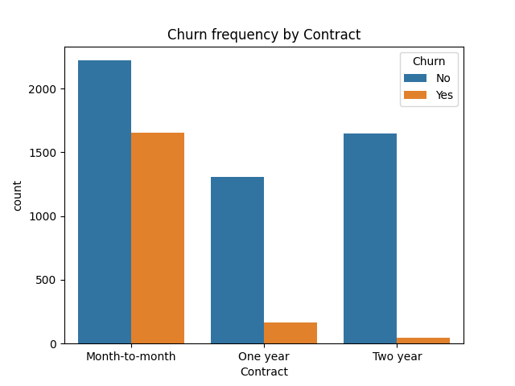
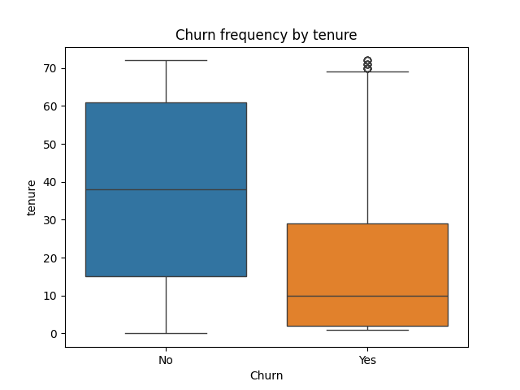
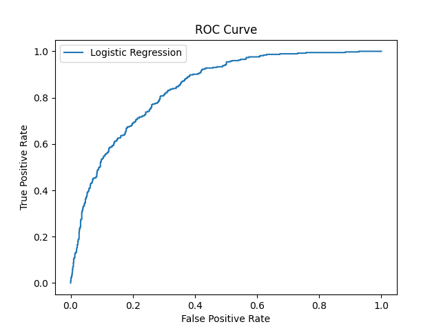
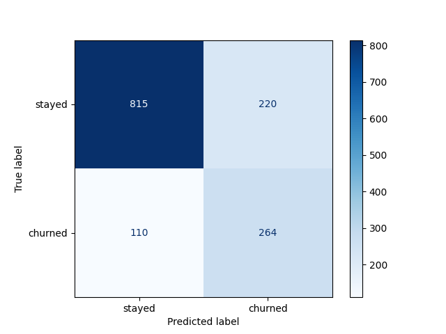

# Telco Customer Churn Prediction

Predicting which customers are about to leave — before they do — so a telecom business can step in with retention offers instead of finding out after the fact.

## The Problem

Customer churn is expensive: acquiring a new customer costs far more than retaining an existing one. This project builds a classification model that flags at-risk customers from their account and service data, tuned specifically to catch as many real churners as possible — because for a retention team, missing a real churner is far costlier than a wasted retention offer on someone who was staying anyway.
try [live app](https://telco-churn-prediction-5fp4jhn7grdgvrx4bvba9b.streamlit.app/)

## Key Insight

Contract length and tenure dominate everything else. Month-to-month customers churn at **42.7%**, compared to just **2.8%** for two-year contracts. New customers (under ~18 months) churn at **44.4%**, dropping to **8%** for long-term customers. Fiber optic internet and electronic check payments are the two next-strongest risk signals.




| Factor | Higher Churn Risk | Lower Churn Risk |
|---|---|---|
| Contract | Month-to-month (42.7%) | Two-year (2.8%) |
| Tenure | New, <18mo (44.4%) | Long-term, 54mo+ (8%) |
| Internet | Fiber optic (41.9%) | DSL (19.0%) |
| Payment | Electronic check (45.3%) | Auto bank/card (~16%) |

## Approach

1. **Data Cleaning** — found `TotalCharges` was stored as text due to 11 blank entries (all brand-new, tenure=0 customers); converted to numeric and filled with 0
2. **EDA** — crosstabs and groupby analysis across contract, tenure, internet service, payment method, and demographics to isolate real churn drivers
3. **Feature Engineering** — `ColumnTransformer` pipeline combining `StandardScaler` for numeric features and `OneHotEncoder` for categorical features
4. **Modeling** — compared Logistic Regression, Random Forest, and Gradient Boosting
5. **Threshold Tuning** — since missing a churner is costlier than a false alarm, tuned the decision threshold down from the default 0.5 to prioritize recall
6. **Explainability** — SHAP for per-customer, individual-level churn risk explanations
7. **Validation** — 5-fold cross-validated ROC-AUC to confirm results weren't a lucky split

## Model Comparison

| Model | Accuracy | Churn Recall | Churn Precision |
|---|---|---|---|
| Logistic Regression | 0.80 | 0.55 | 0.64 |
| Random Forest | 0.78 | 0.47 | 0.61 |
| Gradient Boosting | 0.80 | 0.53 | 0.67 |

Logistic Regression held up best overall — a reminder that a simpler, well-preprocessed model can outperform more complex ones without tuning.

**ROC-AUC: 0.841** (single split) · **0.846** (5-fold cross-validated)



## Threshold Tuning — A Business Decision

| Threshold | Churn Recall | Churn Precision |
|---|---|---|
| 0.50 (default) | 0.55 | 0.64 |
| 0.45 | 0.62 | 0.60 |
| 0.40 | 0.67 | 0.57 |
| **0.35 (chosen)** | **0.71** | **0.55** |
| 0.30 | 0.75 | 0.52 |

Chose **0.35** — catches significantly more real churners (71% vs. 55% at default) at the cost of more false alarms, which is the right tradeoff when a false alarm just means an unnecessary retention offer, but a missed churner is a lost customer.



## Explainability (SHAP)

Beyond flagging *who* is at risk, SHAP explains *why* — critical for a retention team deciding what offer might actually keep a specific customer.


Confirms the EDA and model coefficients: tenure and contract type dominate, fiber optic and electronic check push risk up.

## Tech Stack

`Python` · `pandas` · `NumPy` · `scikit-learn` · `SHAP` · `matplotlib` · `seaborn`

## Run it locally

```bash
pip install -r requirements.txt
jupyter notebook Churn_Analysis_Notebook.ipynb
```

## Dataset

[Telco Customer Churn Dataset](https://www.kaggle.com/datasets/blastchar/telco-customer-churn) — 7,043 customers.

---
*Built by [Toufiq](https://github.com/Toufiq1806)*
